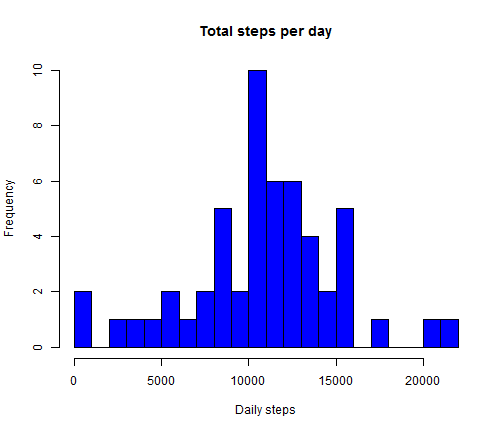
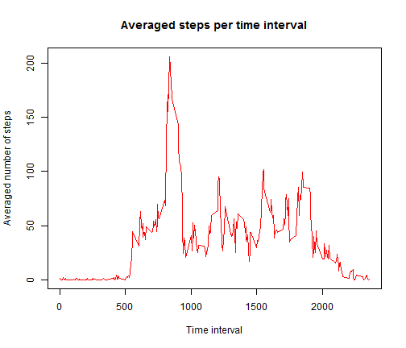
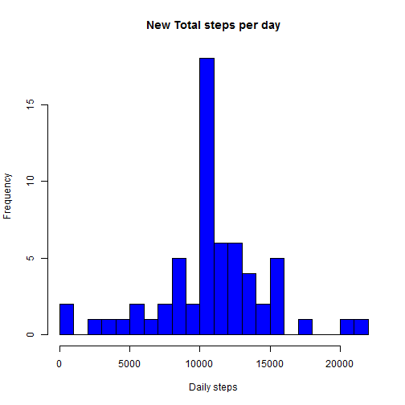
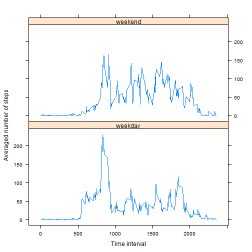

Reproducible Research - PA 1
========================================================
## Loading and Preprocessing the data


```r
mydata <- read.csv("activity.csv")
```


## What is mean total number of steps taken per day

### 1. Histogram


```r
steps.total <- aggregate(steps ~ date, data = mydata, FUN = sum)
hist(steps.total$steps, breaks = 20, col = "blue", xlab = "Daily steps", ylab = "Frequency", 
    main = "Total steps per day")
```

 


### 2. Mean and median


```r
mean <- mean(steps.total$steps)
median <- median(steps.total$steps)
```


The **mean** total number of steps taken per day is 1.0766 &times; 10<sup>4</sup>.
The **median** total number of steps takes per day is 10765.

## What is the average daily activity pattern?
### 1. Time series


```r
steps.interval <- aggregate(steps ~ interval, data = mydata, FUN = function(x) {
    mean(x, na.rm = TRUE)
})
plot(steps.interval$interval, steps.interval$steps, type = "l", col = "red", 
    xlab = "Time interval", ylab = "Averaged number of steps", main = "Averaged steps per time interval")
```

 


### 2. The 5-minute interval constains the maximum number of steps


```r
max.interval <- steps.interval$interval[which.max(steps.interval$steps)]
```


The 5-minute interval is: **835**.

## Imputing missing values
### 1. Total number of NAs


```r
N <- sum(is.na(mydata))
```


The total number of NAs in the dataset is: **2304**.

### 2. Filling in all the missing values in the dataset

I will use the mean value for that 5-minute interval to fill the NA.

### 3. New dataset with missing data filled in

I'm going to use a for loop to achieve this goal.

```r
for (n in 1:nrow(mydata)) {
    if (is.na(mydata$steps[n])) 
        mydata$steps[n] <- steps.interval$steps[which(steps.interval$interval == 
            mydata$interval[n])]
}

head(mydata)
```

```
##     steps       date interval
## 1 1.71698 2012-10-01        0
## 2 0.33962 2012-10-01        5
## 3 0.13208 2012-10-01       10
## 4 0.15094 2012-10-01       15
## 5 0.07547 2012-10-01       20
## 6 2.09434 2012-10-01       25
```

```r
summary(mydata)
```

```
##      steps               date          interval   
##  Min.   :  0.0   2012-10-01:  288   Min.   :   0  
##  1st Qu.:  0.0   2012-10-02:  288   1st Qu.: 589  
##  Median :  0.0   2012-10-03:  288   Median :1178  
##  Mean   : 37.4   2012-10-04:  288   Mean   :1178  
##  3rd Qu.: 27.0   2012-10-05:  288   3rd Qu.:1766  
##  Max.   :806.0   2012-10-06:  288   Max.   :2355  
##                  (Other)   :15840
```


### 4. Histogram and other calculation


```r
steps.total_new <- aggregate(steps ~ date, data = mydata, FUN = sum)
hist(steps.total_new$steps, breaks = 20, col = "blue", xlab = "Daily steps", 
    ylab = "Frequency", main = "New Total steps per day")
```

 

```r

mean_new <- mean(steps.total_new$steps)
median_new <- median(steps.total_new$steps)
```


After filling up the NAs, the **new mean** total number of steps taken per day is 1.0766 &times; 10<sup>4</sup>.
The **new median** total number of steps takes per day is 1.0766 &times; 10<sup>4</sup>.

Compared with the values obtained previously, the impact of imputing missing data on the estimates of the total daily number of steps is negligible. However, it does have influence on the distribution of total steps per day. The peak arount 0 step disappears.

## Activity patterns between weekdays and weekends

### 1. Create a new factor variable


```r
type <- function(date) {
    Sys.setlocale("LC_TIME", "English")
    week <- weekdays(as.Date(date))
    if (week %in% c("Saturday", "Sunday")) {
        "weekend"
    } else {
        "weekday"
    }
}

mydata$daytype <- as.factor(sapply(mydata$date, type))

head(mydata)
```

```
##     steps       date interval daytype
## 1 1.71698 2012-10-01        0 weekday
## 2 0.33962 2012-10-01        5 weekday
## 3 0.13208 2012-10-01       10 weekday
## 4 0.15094 2012-10-01       15 weekday
## 5 0.07547 2012-10-01       20 weekday
## 6 2.09434 2012-10-01       25 weekday
```

```r
summary(mydata)
```

```
##      steps               date          interval       daytype     
##  Min.   :  0.0   2012-10-01:  288   Min.   :   0   weekday:12960  
##  1st Qu.:  0.0   2012-10-02:  288   1st Qu.: 589   weekend: 4608  
##  Median :  0.0   2012-10-03:  288   Median :1178                  
##  Mean   : 37.4   2012-10-04:  288   Mean   :1178                  
##  3rd Qu.: 27.0   2012-10-05:  288   3rd Qu.:1766                  
##  Max.   :806.0   2012-10-06:  288   Max.   :2355                  
##                  (Other)   :15840
```


**Note**: Sys.setlocale("LC_TIME", "English") is  to convert my system time expressed in English.

### 2. Making the panel plot containing a time series plot


```r
steps.new <- aggregate(mydata$steps, by = list(mydata$interval, mydata$daytype), 
    FUN = function(x) {
        mean(x, na.rm = TRUE)
    })
names(steps.new) <- c("interval", "daytype", "AveStep")

library(lattice)
with(steps.new, xyplot(AveStep ~ interval | daytype, type = "l", layout = c(1, 
    2), xlab = "Time interval", ylab = "Averaged number of steps"))
```

 


